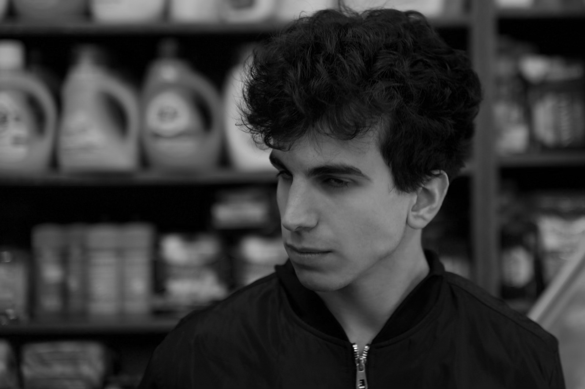

# Arin Gokdemir

Dude, we were crazy. It was DC, so you leave the school and walk outside and the White House is right there. We used to explore all sorts of stuff. I was a bad kid. I wasn't a big drinker or smoker, I was just a problem for my parents. 

I was a terrible student in high school. I was just messing around. So my parents told me, hey, it's August, we need you to just get out of the house. Go live your life somewhere. So I went to Virginia Commonwealth University.

I got there and realized that it wasn't for me. It felt like a dead end. So I thought, this can't be where my academic journey ends. I know I have more to offer. So I just started grinding. I was trying to fight for my place somewhere better. 

At the top of my list was BU, because it had a great film program. I wanted to be a film director at the time. I got COVID about the week before I had to put in the applications and my grandmother passed away, unfortunately, so I was dealing with those two things at one time. I ended up just getting the BU application in. I didn't have any time or energy for the others because I was bedridden. I sent it out and then went to sleep for three days. 

It wasn't that long later, I was in line at Chick-fil-A in my flip-flops and I got an email. I took my flip-flops off and I just sprinted across Richmond. I forgot about the order. I actually cried. I knew something had changed. My life was about to change for real.

When I got to BU, I realized how privileged I was. You meet every type of damn person at this school. Even comparing my schedule to someone else's schedule, you can see the imbalance. Three jobs will fill up that Google calendar in a way that one will not. 

I would never perceive having three jobs to be flexing. The only type of person who would are those who have never worked 3 jobs before. No one has three jobs out of a desire to flex on people. People who think that way are about “The hustle”. That's another thing, "the hustle". I feel like that's a privileged concept. It's like they're making money and doing all these things, but it's frivolous. It's not for survival, it's for clout.

I work pretty hard right now, but once I'm not, I'm gonna be working to improve my situation further so that I can help other people survive. Or make the things that I want to see happen. Ultimately in a capitalist economy, to make progress on any front, some money has to exchange hands. Time is money, projects are money, goals, and ambitions require money.

