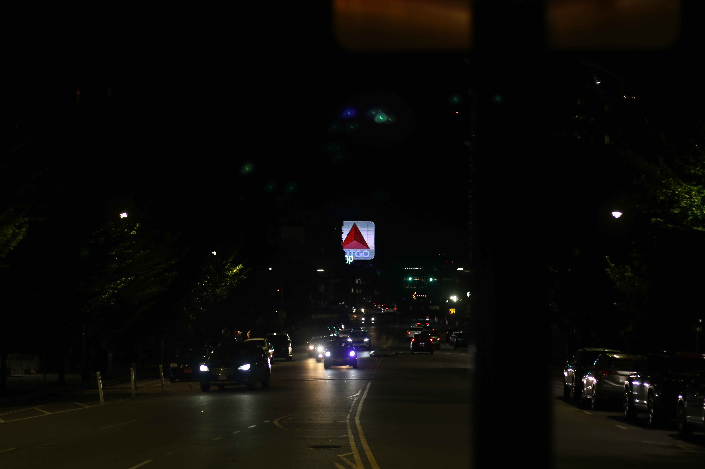

# Cheryl Lin

I had a really tough time before I transferred to BU. So growing up I did martial arts with my dad. I trained with a bunch of weapons, it was almost my personality, I guess. So going to college, I was really into stuff about fighting. I liked reading scary stuff and practicing martial arts in my dorm. I thought me and my roommates were close, we would chat and go out for dinner, that kind of thing. But I guess they didn't feel comfortable with me because a month after living together, they kicked me out. They basically locked me out of the dorm and told whoever was in charge of the dorm that I was gonna hurt all of them. I had to stay at someone else's place. During that period, they went through all my stuff and took stuff for themselves. For a whole year, I had to stay at someone else's place and I couldn't get any of my belongings back. I also didn't get a refund for the dorms. So be careful who you trust. 

When I came to BU I started being responsible for my income. My parents don't provide for me. They’re on their own, I'm on my own. I’ve had to learn things like doing your taxes, buying your own insurance, managing your own finances, and finding some jobs that can provide for you. It’s especially tough in Boston because it's such an expensive city. I don't really go out much anymore because it’s expensive and I don't want to use like money if I don't have to.

It was tough because I was on academic probation for a while. I was having a hard time with mental health and I not doing well in some of my classes. I dropped some of them and became a part-time student. But if you become a part-time student halfway through a semester, they raise a flag on your student link account. So I got put on that and then they told me that I could try one more semester to get out of it. I tried, but I was still going through mental stuff and I burned out because at that point it was five years of college. I was still trying to figure out what to do with my major and what to do in life. I also didn't do too well in those classes. I ended up missing the mark. At first, I felt kind of happy because I didn’t wanna go to college anymore. But then I realized I have so many student loans and if I quit it would be such a waste of money.
So I thought even if I don't want to go, I might as well go back and just try to finish up. If I finish, at least I have a degree. 

Now, I realize it's fine if you don't know what you wanna do or if you’re undeclared or whatnot. That’s fine. Like, you don't have to rush. A lot of colleges put pressure on you to pick before your sophomore or junior year. It’s fine if you want to take your time on it because it's best if you choose a major that you actually enjoy instead of choosing one due to pressure and then later on having to transfer to a different major and then spending more time in college. 

I think it’s important to be wise about making friends and to be wise about your financials and college courses. Try hard in your classes and don't be afraid to ask for help. That was my big thing. I was afraid to ask for help and to make friends. Try to be social. It's fine if you are very introverted or a very timid type of person. You don't have to be pressured to go to parties or hang out with people. Just try to find people that fit your niche. Enjoy yourself because it's gonna be like your last four years of academics before you venture out into the real world. So it's best if you enjoy it now.
