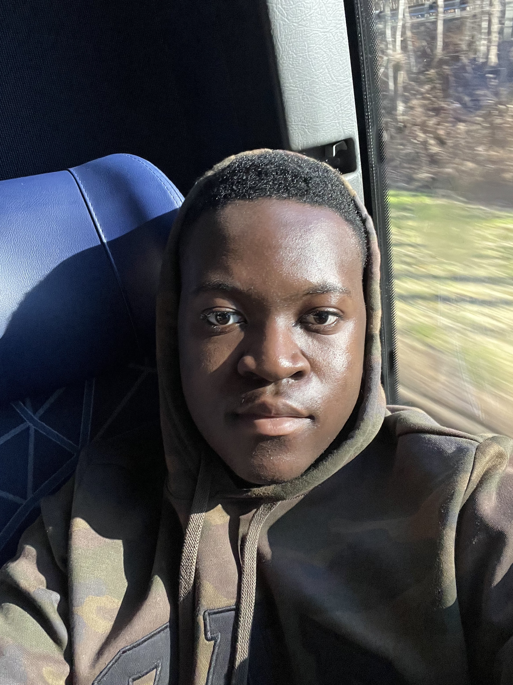

# Javaugn Headly

I think I've gotten better at not having FOMO as much. I guess I learned that I shouldn't feel guilty about how much I earn or how much my family earns. No matter what the circumstances are. And honestly, I realized that there are a lot of things you can do that are, like, cheaper or free or around Boston. And so I try to suggest those kinds of ideas and if people are not for it, then they're not. And if they are, they are.

I suppose as a low-income student, you're only going to interact with these kinds of people more and more. Before I guess I used to see them as more, like, foreign, and maybe even villainize them a bit. But I guess like me, they're just living life and they just happen to live life earning more and having more resources. Sometimes it's not exactly people's responsibility to, I don't know, make people more aware of the world around them.

I think BU does help a lot financially for sure. Their aid and their merit scholarships are quite generous for sure. And I do commend them for doing that. I guess it's kind of hard to see how they would do this, but I will say the social integration is a bit lacking. I feel like there could be more things on the social end. I think it's one thing to give people the opportunity to come to these schools and I do appreciate that for sure, but I think that helping people navigate how to socially be in these spaces is just as important as giving them the opportunity to have education in these spaces. 

I guess if you feel passionate enough, then you can help be a guide for those kinds of people to be more cognizant of the world around them. It may be a bit hard to conceptualize how is it that like, you can't afford to do something, or like why is it like you have to ditch so much? They may take it more personally than it just being a matter of fact of, I just can't afford to do this activity.
