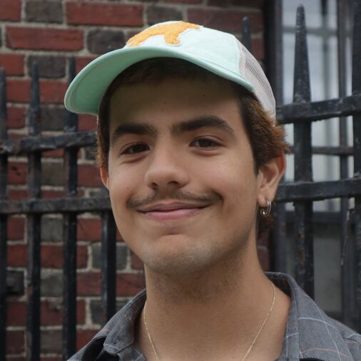

# Jesús Marrero Suárez

When I got to BU, I started doing journalism. Journalism is a freaky thing because you do a story and you don't ever really know how it's gonna end up. In a lot of ways, it was very chilling to have so many people tell you their stories and experiences and then write about them. In some cases, you come across a couple of people who are just fucking freaks.

You get small things that just feel like microaggressions, but you're never really sure. And you kinda also realize you're a minority. I went to a high school in Puerto Rico, in a neighborhood in the capital called Cupey. I was a little different because I was an immigrant. I'm Venezuelan. Sometimes I think, Oh maybe that was part of the reason why I felt so alienated from everybody in my high school. Because I didn't have the same background. They spoke in a different accent and did different things at the time. But we were all Latino, so we were all on the same vibe, with similar backgrounds and tastes. There was never a stark separation. I never felt like I was the only one of my kind until I got to BU. And I realized, oh my God, why are there only two people of color in this entire lecture hall?

It wasn't just the students. Most of the professors are mostly white. They were teaching material that was just straight-up white. You can feel a little bit alone in situations like that. So I was naturally drawn to people of color. I would take classes with professors of color. I don’t have many Puerto Rican friends here, but everybody kind of shares that same feeling that they are in a room full of people who don't look like them, don't say their names in the same way that they do, who don't have to worry about some of the things that they do. It brings a whole bunch of us together. We have a sense of solidarity.
 

