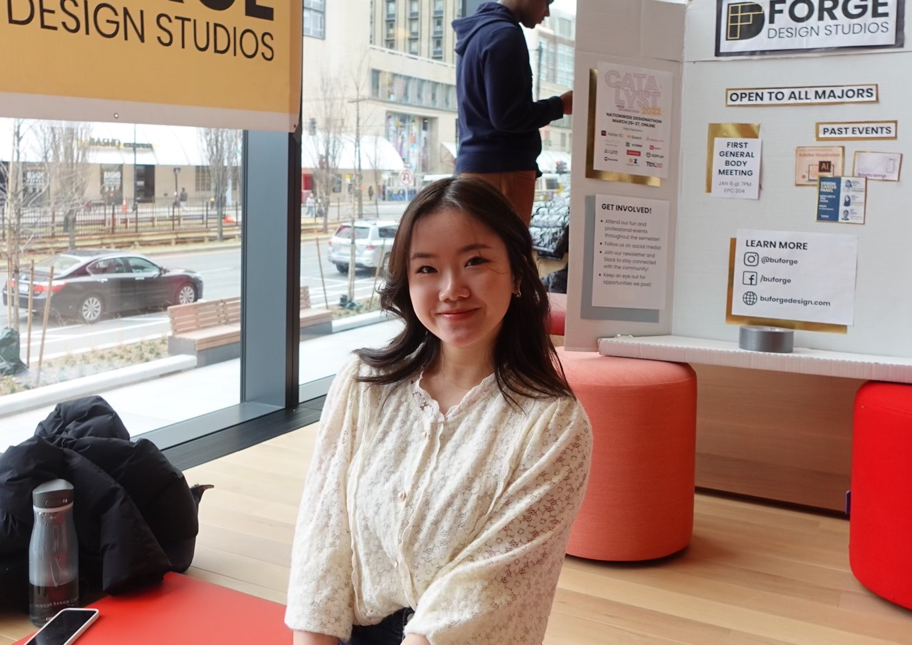

# Kristi Li

The lifestyle here is way faster. I feel like I always need to be working on something. I started planning, like with a planner, after I came to college. I didn't do that in high school. I just look at my planner and I want to fill out every single box. If I don't, I feel like I'm slacking. It feels like everybody is doing the same thing. You get that invisible peer pressure. 

But I’ve been trying not to stress as much and explore. This world is too polarizing in a lot of aspects, whether it's politics or ideologies. I'm the type of person who wants to welcome all thoughts. That's why I think exposure is really important. You don't necessarily have to agree with another person, but I think it's important to be a good listener and just be exposed to ideas different from your own. Coming into college, the first thing I did was join JSA. Even though I don't have any family members who are Japanese, Japan is a very important place to me. I wanted to expose myself to the culture more. And I was really proud of myself for attending their first general meeting! I remember it clearly: it was September before COVID, and I went there by myself. I have always been a very shy person, but I started talking to strangers and then ended up in e-board that semester! I was still very proud of myself because I stepped out of my comfort zone and made a lot of Japanese friends.

