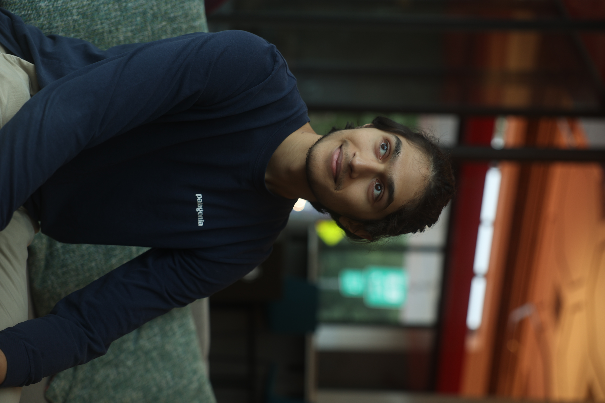

# Rithvik Doshi

I feel like in college, I started being more honest with myself, trying to figure out who I am and how not to define myself in relation to other people or like by comparing myself to other people. At the same time, I feel like I'm still trying to break down specific behaviors that I have and that have been carried on from my parents that can be counterproductive to myself or can sometimes hurt other people.

Like, I've kind of started to accept that it's okay if I'm not the best at something. I don't even have to be trying my best because sometimes that's like, very exhausting. Like, imagine you're giving your 100% every single day, and while some people like to say that they do that, it's just very hard to actually do that. I think as long as I enjoy what I'm doing, I'm in the right place, and if I don't enjoy what I'm doing then I have to stop doing that.

That's sort of like the perspective that music has given me. I still enjoy it so I keep doing it, I guess. Sometimes I'm just going around my life and a song is playing in my head, or like, something I'm composing and I'm like, wait, this is a good idea. Also, it's cool to collaborate with good musicians and make some good music. Yeah, yeah. Yeah…..

Woah what’s that? *points to floor* *sees the got ‘em sign* *sprints away at half the speed of light* *end of transcript*

