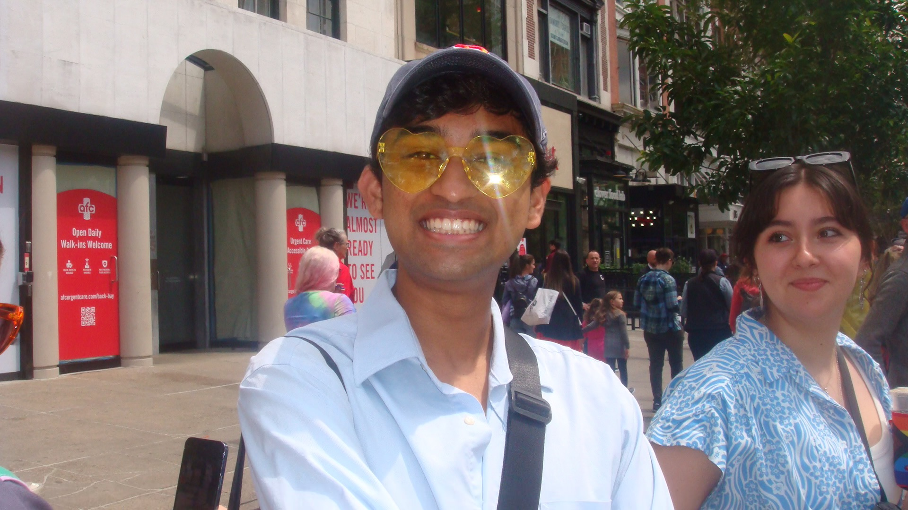

# Smaran Ramidi

I have an appreciation for people. My best times are around people. I just appreciate getting to know people and learning so much about what makes them them. If I spend more than 24 hours by myself with little interaction with people, I start feeling emotionally drained, which is the complete opposite of a lot of people.

I have mellowed out a lot. I've actually got so many Snapchat memories recently of how I was freshman year and I mellowed out a lot more. I used to be a lot more flamboyant, but now I'm more reserved. I've honestly matured. I'm more focused. It could be the stress. I feel like I've taken on 50 years being here. It's crazy. 

My mindset on everything has changed and I think a part of it is just growing up far away from my parents. I've been in Boston for the last two summers. I'm supposed to be in Boston this summer again. This has become my home. My parents hate to hear it and they make fun of me for it. But when I say home, I say here because I've spent the last two years of my life here. Going back to Ohio is kind of a break.

That's a part of what has mellowed me out. Going between the school year where I know so many people to the summer when I don't know anyone. It’s been important adapting to what it's like to be alone and on your own.